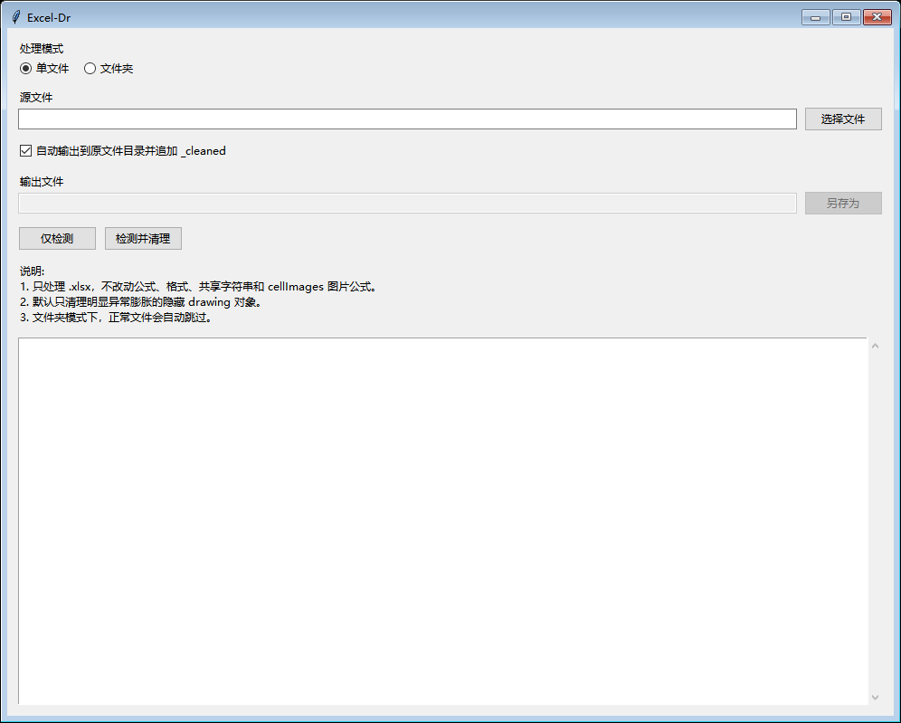

# Excel-Dr

[](https://github.com/LCbeijing/Excel-Dr/releases)
[](./LICENSE)
[](https://github.com/LCbeijing/Excel-Dr)
[](https://github.com/LCbeijing/Excel-Dr)

<p align="center">
  
</p>

<p align="center">
  <strong>一款专门修复 Excel / WPS 报表隐藏垃圾数据问题的便携工具。</strong>
</p>


## What Is It

Excel-Dr，中文可以理解为“Excel 医生”。

它不是一个泛泛而谈的“表格优化器”，而是一个专门面向真实办公报表场景的修复工具：  
**精准识别 `.xlsx` 内部异常膨胀的隐藏对象，并做保守清理。**

很多报表真正拖慢体验的，并不是可见的业务数据，而是长期复制、粘贴、继承模板、多人接力维护之后，悄悄积累在工作簿内部结构里的隐藏垃圾数据。

Excel-Dr 要解决的，就是这种问题：

- 报表打开越来越慢
- 保存、关闭、筛选明显卡顿
- 行数不算离谱，但体验非常糟糕
- 从旧模板复制表头后，新文件继续继承卡顿

## Why It Matters

Excel-Dr 的价值，不在于“清理得多”，而在于“清理得准”。

- **精准识别**：重点锁定异常膨胀的隐藏 `drawing` 对象
- **保守处理**：不粗暴破坏公式、样式、共享字符串和 `cellImages` 图片公式
- **便携易用**：Windows 解压即用，删除目录即卸载
- **适合推广**：支持单文件处理，也支持文件夹批量处理
- **面向现实工作**：为财务、运营、订单、仓储、行政等真实报表场景设计

如果要用一句话概括：

**它不是在优化表格外观，而是在修复表格内部结构里的隐藏垃圾。**

## Typical Use Cases

- 财务月度订单汇总表
- 电商发货清单、售后台账、对账表
- 微信群人工录入订单表
- 多人长期接力维护的历史模板
- WPS / Excel 里那种“看起来不算大，但就是越来越卡”的报表

## Core Capabilities

### 1. 单文件检测

快速告诉你：

- 有没有异常隐藏对象
- 预计清理多少
- 有没有损坏的数据有效性
- 问题主要命中在哪张工作表

### 2. 单文件清理

- 默认另存为 `_cleaned.xlsx`
- 不覆盖原文件
- 清理前先弹出确认提示

### 3. 文件夹批量检测

扫描整个文件夹内的 `.xlsx`：

- 扫描文件数
- 需要处理的文件数
- 异常隐藏对象总量
- 正常文件与异常文件分别列出

### 4. 文件夹批量清理

- 只处理真正命中异常的文件
- 正常文件自动跳过
- 每个异常文件各自输出一个 `_cleaned.xlsx`

## Detection Strategy

Excel-Dr 不是“见对象就删”。它只会在满足明显异常特征时才出手。

当前策略重点包括：

- 只处理 `.xlsx`
- 重点检查 `drawing` 绘图层
- 只关注隐藏对象
- 只有当同一隐藏图片资源在同一锚点或少数锚点上大量重复出现时，才判定为异常膨胀
- 同时清理明显损坏的 `#REF!` 数据有效性规则

这意味着：

- 正常可见图片默认不会删
- 正常图表和普通对象默认不会删
- 单元格公式不会改
- 样式不会改
- `cellImages.xml` 中的单元格图片公式不会改

## Product Interface

### 实际界面截图



### 交互原则

- 普通办公用户一看就能上手
- 先检测，再清理
- 所有风险动作前都先确认
- 文件夹模式默认跳过正常文件

## Why It Beats Manual Cleanup

手工处理这类问题，通常意味着：

- 解压 `.xlsx`
- 手动查 XML
- 人工判断哪些关系该删
- 反复试错

这对大多数办公用户来说几乎不可行。

Excel-Dr 把这件事产品化成了一个非常直接的流程：

1. 选文件或文件夹
2. 看检测结果
3. 确认清理
4. 输出新文件

## Who Should Use It

- 财务人员
- 运营团队
- 订单和仓储团队
- 行政、人事、客服
- 需要长期维护 Excel 模板的人
- 被“老报表越来越卡”困扰过的人

## Run It

### Windows 便携版

推荐直接使用 Windows 便携版：

- 解压
- 双击 `Excel-Dr.exe`
- 用完直接删除目录即可

### Python

```powershell
python cleaner.py
```

### CLI

单文件：

```powershell
python cleaner.py --scan "C:\path\file.xlsx"
python cleaner.py --clean "C:\path\file.xlsx" --output "C:\path\file_cleaned.xlsx"
```

文件夹：

```powershell
python cleaner.py --scan-folder "C:\path\folder"
python cleaner.py --clean-folder "C:\path\folder"
```

## Build

```powershell
build_exe.bat
```

或手动：

```powershell
pip install pyinstaller
pyinstaller --noconsole --onefile cleaner.py --name Excel-Dr
```

## Promotion Copy

仓库内附了一份可直接拿去发朋友圈、社群、公众号或项目介绍页的宣传素材：

- [宣传文案](./docs/promo-copy.md)

## Open Source

欢迎：

- 提交 issue
- 提交样本和复现描述
- 提出识别策略优化建议
- 贡献更强的规则和 UI 改进

如果你手里有特别卡的报表，而 Excel-Dr 没命中，或者命中了但你希望识别得更细，欢迎反馈。

## Vision

Excel-Dr 想做的，不只是清理几个对象。

它想成为一个真正面向普通办公用户的 Excel 报表修复工具：  
能解释问题、能定位问题、能处理问题，而且足够轻、足够稳、足够直接。

让那些本来应该服务工作的报表，不再反过来拖累工作。
